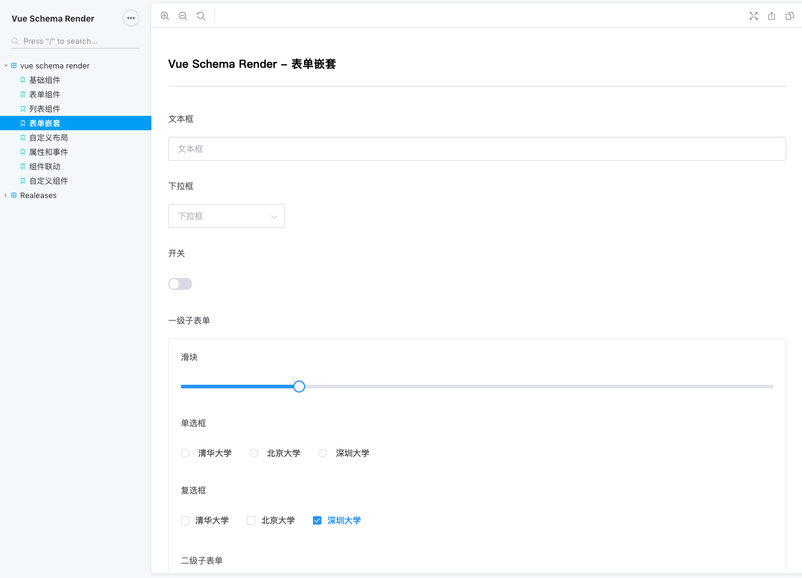

# vue-schema-render
A Form Render Based on JSON Schema for Vue

[![npm][npm-image]][npm-url]

[npm-image]: https://badge.fury.io/js/vue-schema-render.svg
[npm-url]: https://www.npmjs.com/package/vue-schema-render

## Features

- 内置 ElementUI 组件
- 支持自定义组件
- 支持自由布局
- 支持样式覆盖
- 支持多语言
- 支持列表组件拖拽
- 支持无限嵌套表单以及嵌套校验，自定义校验规则
- 支持组件联动
- 详尽的文档及示例


## 安装
`npm install -S vue-schema-render`


## 使用

入口文件 `index.js`

```js
// vue-schema-render 依赖 vue, element-ui，必须先引入
import Vue from 'vue';
import ElementUI from 'element-ui';
import 'element-ui/lib/theme-chalk/index.css';
import App from './app.vue';

Vue.use(ElementUI);

new Vue({
  el: '#app',
  render: h => h(App),
});
```

`app.vue`

```html
<template>
  <schema-render
    :schema="schema"
    ref="schemaRender"
  >
  </schema-render>
</template>

<script>
import { SchemaRender } from 'vue-schema-render';
import schema from './schema.js'; // 组件描述文件

export default {
  components: {
    SchemaRender,
  },
  data () {
    return {
      schema,
    };
  },
  methods: {
    async genData () {
      // 获取表单数据
      const data = await this.$refs.schemaRender.genData();
    }
  }
};
</script>
```


## 预览

DEMO: [click here](https://vue-schema-render.hisheng.now.sh/)




## TODO

- [x] 支持更自由的布局
- [x] 支持列表组件项拖拽
- [x] 监听自定义事件
- [x] 表单填写进度
- [x] 支持 label tooltip
- [x] 支持 component tip
- [ ] 支持添加内置组件
- [ ] 支持组件 slot
- [x] 是否保留 onChange
