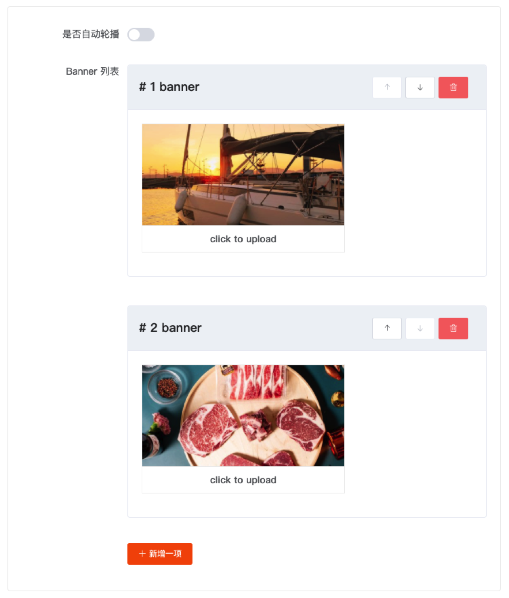

# Vue Schema Render

如果你写过后台界面，应该了解你的大部分工作都是不停地：

> 新业务 => 原型 => 写表单 => 写表单组件 => 交互细节 => 校验规则 => 数据生成 => 新业务 ... 

这样来回折腾，而且还面临着不同的开发者写出来的表单功能大同小异，实现和界面却参差不齐的问题...

`vue-schema-render` 的出现一开始就是为了解决这样的开发痛点；

不过，现在其应用场景也不只是后台表单而已，它的能力不止如此。

## 三部曲

### 先写一个 schema

首先，先写一个大概这样的 schema:

> 可使用 [Schema 生成器](./schema-generator) 快速生成你的 schema

```js
export default {
  components: [
    {
      title: "是否自动轮播",
      type: "switch",
      key: "autoplay",
      value: true
    },
    {
      title: "Banner 列表",
      type: "list",
      key: "banners",
      component: {
        title: "banner",
        type: "upload",
        value: ""
      }
    }
  ]
};
```

### 渲染出表单

经过 `vue-schema-render` 解析渲染得到如下表单：



### 使用表单得到数据

通过表单，生成 JSON 数据大致如下:

```json
{
  "autoplay": false,
  "banners": [
    "https://xxx.com/a.png",
    "https://xxx.com/b.png"
  ]
}
```

至此，数据到手可以直接使用了

在这个过程中，你：

1. 不用经过复杂琐碎的项目搭建
2. 不用辛辛苦苦地去实现表单界面，交互细节
3. 不用关心表单组件的实现，担心不同页面表单的复用
4. ... 等等


## 使用

安装

```js
npm i -S vue-schema-render
```

在你的项目中：

```js
import Vue from 'vue';
import SchemRender from 'vue-schema-render';

Vue.use(SchemRender);
```

模板

```html
<vue-schema-render :schema="schema"></vue-schema-render>
```
